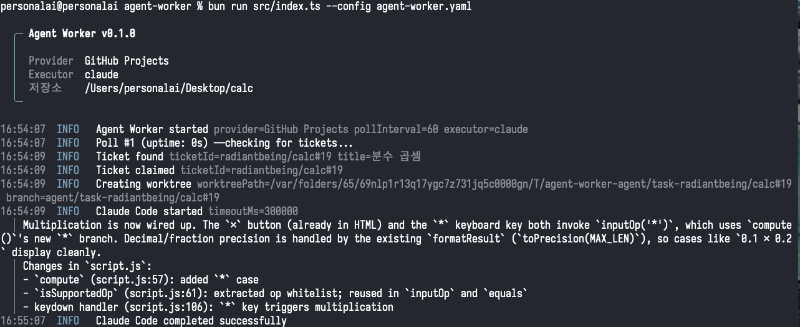

# agent-worker

이슈 트래커 (Linear, GitHub Projects v2) 의 티켓을 폴링해 AI 코딩 에이전트 (Claude Code, Codex) 에 자동으로 위임하는 워커.



## 동작

```
ready 픽업 → in_progress 전환 → 워크트리 생성 → pre-hook → 에이전트 → post-hook → in_review (성공) / failed (실패) → 다시 폴
```

같은 repo 를 가리키는 워커를 여러 개 동시 실행해도 됩니다 (각자 별도 워크트리·브랜치).

## 사전 요구사항

- [Bun](https://bun.sh) 1.0+
- 에이전트 CLI: `claude` 또는 `codex` (인증 완료 상태)
- provider 토큰: Linear API key 또는 GitHub PAT (`project` scope, private repo 는 `repo` 도)

## 설치

```bash
git clone https://github.com/coral-pai/agent-worker
cd agent-worker
bun install
bun run build       # → dist/agent-worker
```

크로스 플랫폼: `bun run build:darwin-arm64`, `bun run build:darwin-x64`, `bun run build:linux-x64`.

## 빠른 시작

```bash
cp agent-worker.example.yaml agent-worker.yaml
# agent-worker.yaml 편집 후
export LINEAR_API_KEY=lin_api_...        # 또는 GITHUB_TOKEN=ghp_...
agent-worker --config ./agent-worker.yaml
```

## 설정

```yaml
provider:
  type: linear              # "linear" | "github"
  poll_interval_seconds: 60
  only_unassigned: true     # assignee 가 지정된 티켓 스킵
  linear:
    project_id: "..."

lifecycle:
  ready: "Todo"
  in_progress: "In Progress"
  in_review: "In Review"
  failed: "Canceled"

repo:
  path: "/abs/path/to/repo"

hooks:
  pre: []
  post:
    - "git add -A"
    - "git commit -m '{id}: {raw_title}'"
    - "git push origin {branch}"
    - "gh pr create --title '{id}: {raw_title}' --body 'Fixes {id}.' --base main"

executor:
  type: claude              # "claude" | "codex"
  timeout_seconds: 300
  retries: 0                # 0–3

log:
  file: "./agent-worker.log"
  level: info               # debug | info | warn | error
```

**Hook 변수**: `{id}` `{title}` `{raw_title}` `{branch}` `{worktree}` `{date}`

**주의**: `lifecycle` 의 네 값은 provider 의 실제 상태 옵션 이름과 정확히 일치해야 합니다 (대소문자·공백 포함). `in_review → Done` 의 최종 전환은 **외부 자동화** 책임 (예: GitHub Project 의 "Pull request merged → Done" 워크플로우).

## Provider 별 셋업

### Linear (`type: linear`)

- 환경 변수: `LINEAR_API_KEY` ([발급](https://linear.app/settings/api))
- `linear.project_id`: Linear → Settings → Projects → URL 끝의 UUID

### GitHub Projects v2 (`type: github`)

- 환경 변수: `GITHUB_TOKEN` (`project` scope, private repo 면 `repo` 도)
- `github.owner` / `owner_type`: 조직이면 `organization`, 개인이면 `user`
- `github.project_number`: project URL 끝의 숫자
- `github.status_field_name`: 상태 single-select 필드 이름 (기본 `"Status"`)
- Issue 만 처리 (PR / draft item 은 자동 스킵)

## 워크트리 격리

Claude executor 는 매 티켓마다 `/tmp` 아래에 워크트리 + `agent/task-{id}` 브랜치를 자동으로 만들어 격리 실행합니다. 작업이 끝나면 자동 정리. 따라서 pre-hook 에 `git checkout` 같은 브랜치 명령은 필요 없습니다.

Codex 는 자체 isolation 을 가지고 있어 워크트리 자동 생성을 건너뛰며, hook 들은 원본 `repo.path` 에서 실행됩니다.

## CLAUDE.md

repo 루트에 `CLAUDE.md` 를 커밋해두면 Claude Code 가 매 실행 시 읽어서 프로젝트 컨벤션·스택을 알아서 따릅니다. 워크트리에도 자동으로 포함됨.

## PR 충돌 해결 (optional)

여러 워커가 만든 PR 끼리 충돌이 생겼을 때, PR 코멘트로 `/agent-worker resolve` 한 줄로 Claude 에게 해결을 시킬 수 있습니다 (머지는 사람이).

**셋업** (target repo 기준):

1. [Claude Code GitHub App](https://github.com/apps/claude) 을 target repo 에 설치
2. target repo Settings → Secrets and variables → Actions 에 `CLAUDE_CODE_OAUTH_TOKEN` 등록  
   (Pro/Max 구독자: 본인 컴퓨터에서 `claude setup-token` 으로 발급)
3. `examples/github-actions/agent-resolve.yml` 을 `.github/workflows/agent-resolve.yml` 로 복사

write 권한 이상 사용자만 트리거 가능. 자세한 옵션은 워크플로우 파일 상단 주석 참고.

## 개발

```bash
bun test            # 테스트
bun run build       # 바이너리 빌드
```

코드 구조는 `src/` (런타임), `test/` (테스트, src 와 동일 구조), `examples/` (사용자가 복사할 템플릿), `docs/` (상세 문서) 로 나뉩니다. 새 provider/executor 추가는 각각 `src/providers/types.ts` 와 `src/pipeline/executor.ts` 의 인터페이스 구현 + factory 분기.

## 라이선스

MIT
